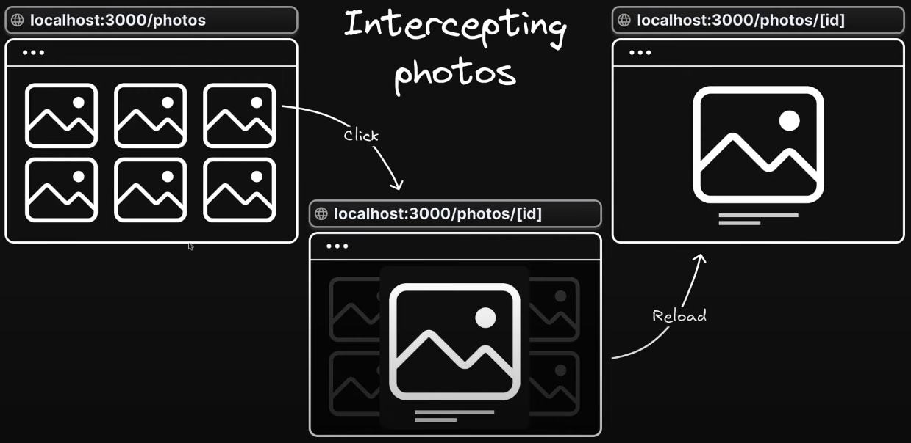

# Advanced Routing Patterns

- Parallel routes
- Intercepting routes

## Intercepting Routes

Intercepring routes allow you to intercept or stop the default routing behaviour to present an alternate view or component when navigating through the UI, while still preserving the intended route for scenarios like page reloads.

This can be useful if you want to show a route while keeping the context of the current page.

## Intercepring Routes Conventions

- (.) to match segments on the same level;
- (..) to match segments one level above;
- (..)(..) to match segments two levels above;
- (...) to match segments from the root app directory.
