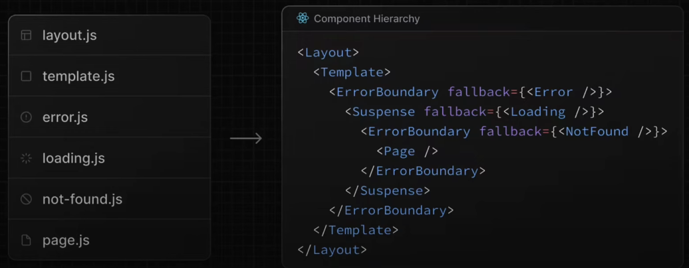

# error.tsx

Automatically wrap a route segment and its needed children in a React Error Boundary. Create error UI tailored to specific segments using the file-system hierarchy to adjust granularity. Isolate error to affected segments while keeping the rest of the application functional. Add functionality to attempt to recover from an error without a full page reload.

## Compnent Hierarchy

